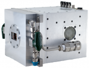

.. _camera-ultra:

Ultra
-------



Introduction
````````````

  "The ULTRA Detector System enables capture of one dimensional spectra at extremely high rates. Where CCDs were used to capture a line of data at a time, the ULTRA Detector System offers many orders of magnitude faster time framing. ULTRA is a compact turnkey system. The data acquisition system is attached in a compact form factor unit with gigabit Ethernet out and multiple I/O options onboard."

.. csv-table:: Ultra Specification

  Sustained Spectral Rate, 20 KHz (spectra per second) Maximum
  Frame Period, <500 ns Minimum
  Spectral Sensitivity, 5 – 17KeV 300µm thickness. 500µm also available.
  Output, Gigabit Ethernet
  Pixel configuration, Si 512 linear strips @ 50µm pitch
  ADC Dynamic Range, 16 Bit
  Synchronisation Inputs, TTL or Fibre Optic
  Integration Time, <1us - 650us frames
  TriggeringExternal, (TTL or Fibre) or Internal (10KHz fixed)

Prerequisite
````````````

The default network setup is (excluding the site network connection):

1GBit Copper network for control communinication between the PC and the Ultra box.

Installation & Module configuration
```````````````````````````````````

Follow the generic instructions in :ref:`build_installation`. If using CMake directly, add the following flag:

.. code-block:: sh

 -DLIMACAMERA_ULTRA=true

For the Tango server installation, refers to :ref:`tango_installation`.

Initialisation and Capabilities
```````````````````````````````

Implementing a new plugin for new detector is driven by the LIMA framework but the developer has some freedoms to choose which standard and specific features will be made available. This section is supposed to give you the correct information regarding how the camera is exported within the LIMA framework.

Camera initialisation
......................

The camera will be initialized within the :cpp::class::`Ultra::Camera` object. A TCP and UDP socket connections on the 1GBit port are established

The Ultra requires the following parameters with the recommended settings::

  headname          = 192.168.1.100
  hostname          = 192.168.1.103
  tcpPort           = 7
  udpPort           = 5005
  npixels           = 512

Std capabilites
................

This plugin has been implemented with respect of the mandatory capabilites but with some limitations which
are due to the camera.  We only provide here extra information for a better understanding
of the capabilities for Ultra cameras.

* HwDetInfo

  getCurrImageType/getDefImageType(): is set to Bpp16

* HwSync

  get/setTrigMode(): the only supported modes are IntTrig, ExtTrigMult and IntTrigMult


Optional capabilities
........................

TODO
